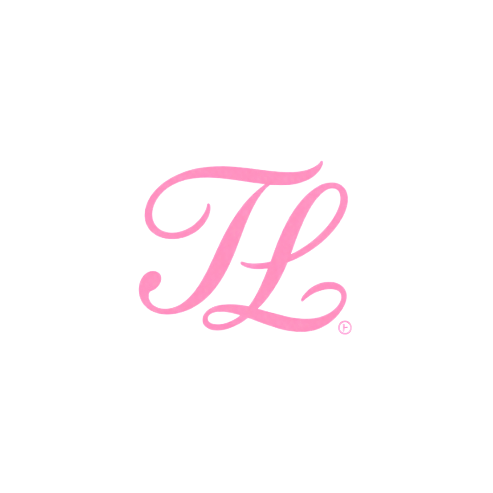

 

<h1 style="font-family: Arial, sans-serif; font-weight: 600; letter-spacing: 1px;">
Thauanne Luna
</h1>

🎨 Designer Gráfica em formação  
💡 Transformando ideias em experiências digitais intuitivas e visuais

---

## 🚀 Sobre mim

Sou estudante de **Informática no Ensino Médio Técnico** e estou construindo minha carreira em **Design Gráfico, Branding e Experiência Visual**.

Tenho experiência prática com:

- Criação de interfaces
- Identidade visual e branding
- Design para redes sociais
- Prototipação e UI Design

💡 Busco minha primeira oportunidade para aplicar meus conhecimentos e evoluir profissionalmente.

---

## 🧠 Mentalidade

- Aprendizado constante  
- Atenção aos detalhes  
- Organização  
- Pensamento analítico  
- Criatividade aplicada à solução  

---

## 🛠️ Tecnologias e Ferramentas

### 🎨 Design & Branding

---

### ⚙️ Ferramentas

---

## 📌 Projetos em destaque

### ✨ Intense Elegance
Site de moda com foco em design e responsividade.

### 📚 StudyMate
Plataforma de estudos com foco em organização e UX.

### 🛍️ Thau Luna Acessórios
Identidade visual e branding de loja própria.

---

## 📚 Formação

🎓 Ensino Médio + Técnico em Informática  
📍 EEEP Professora Luiza de Teodoro Vieira  
📅 Conclusão: 2026  

---

## 📜 Certificados

- Fundamentos em Design Gráfico — Fundação Bradesco  
- Desenvolvimento Pessoal — Fundação Bradesco  
- Comunicação Empresarial — Fundação Bradesco  
- Fábrica de Programadores — UANE  

---

## 🌍 Idiomas

🇺🇸 Inglês — Em andamento  
🇪🇸 Espanhol — Básico  

---

## 🤝 Experiência

Atuação como recepcionista voluntária em eventos escolares (FEPROTEC e FEPROCIC), com foco em:

- Atendimento ao público  
- Organização  
- Trabalho em equipe  
- Responsabilidade  

---

## 📈 GitHub Stats

---

## 📫 Contato

---

## ✨ Objetivo

Crescer como Designer Gráfica, criando experiências visuais bonitas, modernas e funcionais.

---

### © 2026 Thauanne Luna

💗 Todos os direitos reservados.

