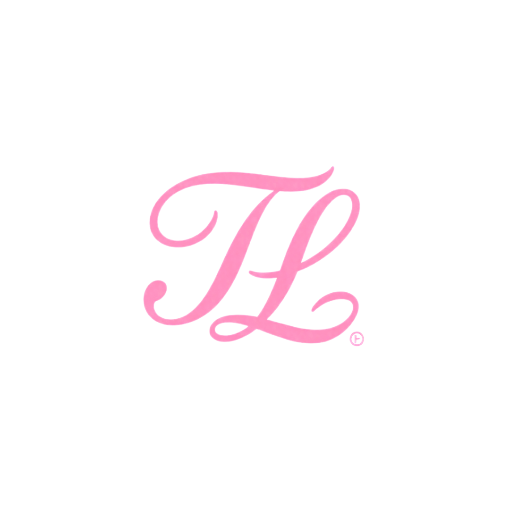

<div align="center">




</div>
---

# 🚀 Sobre mim

Olá! Eu sou **Thauanne Luna**, estudante de **Ensino Médio Técnico em Informática**, apaixonada por **Design Gráfico, Branding, Front-end e criação de experiências visuais**.

Meu trabalho nasce da união entre **criatividade e tecnologia**. Gosto de transformar ideias em projetos que tenham identidade, propósito, estratégia e funcionalidade.

Também sou a criadora da **Thau Luna Studio**, um estúdio que reúne dois universos:

- 🎀 **Universo físico** — produtos personalizados, presentes, boxes e criações feitas à mão.
- 💻 **Universo digital** — design gráfico, branding, identidade visual, sites e experiências digitais.

Além dos projetos comerciais, também desenvolvo projetos autorais e experimentais para explorar novas formas de contar histórias através do design e da tecnologia.

Atualmente desenvolvo projetos envolvendo:

- 🎨 Design Gráfico
- 💎 Identidade Visual & Branding
- 🌐 Desenvolvimento Web
- 📱 UI Design
- 💡 UX Design
- 🛍️ Produtos Personalizados
- 📚 Projetos Autorais
- ✨ Experiências Digitais

---

# 🧠 Mentalidade

```text
CREATIVITY  → transformar ideias em conceitos
DESIGN      → criar experiências visuais
CODE        → transformar conceitos em interfaces
BRANDING    → construir identidades com personalidade
STORYTELLING→ transformar projetos em experiências
LEARNING    → evoluir continuamente
```

### ✦ Princípios que fazem parte do meu processo

- 📚 Aprendizado constante
- 🎯 Atenção aos detalhes
- 💡 Criatividade aplicada
- 🧩 Pensamento analítico
- 🎨 Sensibilidade visual
- 🤝 Organização
- 🚀 Evolução contínua

> **Criatividade também é lógica, estrutura e funcionamento.**

---

# 🛠️ Tecnologias & Ferramentas

## 🎨 Design

<div align="center">


</div>

---

## 💻 Desenvolvimento

<div align="center">


</div>

---

## 📱 Interfaces & Projetos

<div align="center">


</div>

---

# 📌 Projetos

## 🌸 Thau Luna Studio

<div align="center">


</div>

**Meu universo criativo físico e digital.**

A **Thau Luna Studio** nasceu a partir da Thau Luna Acessórios e evoluiu para um Studio que reúne **produtos personalizados, presentes, experiências e serviços criativos**.

### 🎀 Universo Físico

- ✨ Pulseiras personalizadas
- 🔑 Chaveiros personalizados
- 📸 Polaroids
- 🎁 Boxes personalizadas
- 💝 Presentes personalizados
- 📝 Bloquinhos e materiais personalizados
- 🌙 Criações temáticas
- 🎀 Combos e experiências especiais

### 💻 Universo Digital

- 🎨 Identidade Visual
- 💎 Branding
- 🖌️ Design Gráfico
- 🌐 Desenvolvimento de Sites
- 🚀 Landing Pages
- 📱 Artes para Redes Sociais
- 📄 Materiais Digitais
- ✨ Experiências Visuais Personalizadas

### 🌙 Temáticas

Disney • Stitch • Miraculous • Teen Wolf • Animes • Doramas • Filmes • Séries • Livros • Games • Datas comemorativas • Temas personalizados

> **Onde cada detalhe conta!**

🌐 **Site:**  
https://thaulunastudio.lovable.app/

📸 **Instagram:**  
https://www.instagram.com/thauluna_studio

---

## 📚 Luna's Library

Projeto autoral que une **livros, criatividade, storytelling, estética e desenvolvimento web**.

A **Luna's Library** representa uma das minhas experiências digitais mais autorais, explorando a criação de um universo próprio através de uma interface temática e interativa.

O projeto faz parte da minha busca por criar experiências digitais que sejam mais do que páginas: **que tenham atmosfera, identidade e narrativa**.

### ✦ Conceitos explorados

- 📖 Literatura
- 🎨 Direção Visual
- 🌙 Atmosfera
- ✨ Storytelling
- 💻 Front-end
- 🧩 Interatividade
- 📚 Experiência Digital

🌐 **Site:**  
https://thauanneluna.github.io/Lunas_Library/

📸 **Instagram:**  
https://www.instagram.com/lunaslibraryapp

---

## 🐺 Teen Wolf — Beacon Hills

Projeto conceitual inspirado no universo de **Teen Wolf**, criado para explorar desenvolvimento web, UI/UX, storytelling e direção visual.

O projeto apresenta uma experiência temática com personagens, curiosidades, quizzes, mapa de Beacon Hills, elementos sobrenaturais e uma estética cinematográfica.

### ✦ Conceitos explorados

- 🎨 UI/UX
- 🖥️ Interfaces modernas
- 💎 Branding
- 💻 Front-end
- ✨ Design Visual
- 🌑 Storytelling

🌐 **Projeto:**  
https://thauanneluna.github.io/TeenWolf/

---

## 🏰 Enrolados — Reino de Corona

Experiência digital inspirada no universo de **Enrolados**, criada para explorar fantasia, storytelling e construção de ambientes digitais.

O projeto utiliza elementos como lanternas, estrelas, personagens, mapa, música e interações para criar uma atmosfera inspirada no Reino de Corona.

### ✦ Conceitos explorados

- ✨ Direção de arte
- 🌙 Atmosfera
- 🎨 UI/UX
- 💻 Front-end
- 🏰 Storytelling
- 🌟 Interatividade

🌐 **Projeto:**  
https://thauanneluna.github.io/Enrolados/

---

## 🎁 World Perfect Personalizados

Projeto desenvolvido para explorar o universo de **personalização, presentes e identidade visual**.

Uma experiência que combina criatividade, produtos personalizados e comunicação visual.

### ✦ Conceitos explorados

- 🎨 Identidade
- 🎁 Personalização
- 💡 Criatividade
- 🌸 Direção visual
- 💻 Desenvolvimento web

🌐 **Projeto:**  
https://thauanneluna.github.io/WorldPerfect/

---

## ✍️ Depois de Nós

Projeto autoral de romance que explora diferentes áreas da criação:

- ✍️ Escrita criativa
- 🧩 Construção de personagens
- 🌎 Desenvolvimento de universo
- 🎨 Identidade visual
- 💡 Direção criativa
- 🌐 Presença digital

Um projeto que representa meu interesse por **storytelling e construção de universos**, indo além do design tradicional.

---

# 🌐 Portfólio

Meu portfólio reúne meus principais trabalhos e experiências em **Design Gráfico, Branding e criação visual**.

Nele apresento minha trajetória, habilidades, projetos e diferentes formas de aplicar criatividade e tecnologia.

### ✦ Áreas

- 🎨 Design Gráfico
- 💎 Branding
- 🌸 Identidade Visual
- 🖌️ Criação Visual
- 💻 Front-end
- 📱 UI/UX
- ✨ Projetos autorais

<div align="center">

<a href="https://thauanneluna.github.io/PortflioThauanne/">


</a>

</div>

---

# 🎯 Objetivos atuais

- 🚀 Desenvolver cada vez mais minhas habilidades em Front-end
- 🎨 Aprimorar meus conhecimentos em Design e Branding
- 📱 Evoluir em UI/UX
- 💻 Criar experiências digitais mais completas
- 🌸 Expandir a Thau Luna Studio
- 📚 Desenvolver novos projetos autorais
- 🧩 Construir um portfólio cada vez mais consistente
- 🛠️ Aprender novas ferramentas e tecnologias
- ✨ Unir cada vez mais Design + Tecnologia

---

# 🔥 GitHub Streak

<div align="center">


</div>

---

# 📈 Activity

<div align="center">


</div>

---

# 🌍 Idiomas

- 🇧🇷 **Português** — Nativo
- 🇪🇸 **Espanhol** — Intermediário
- 🇺🇸 **Inglês** — Básico

---

# 📫 Contato

<div align="center">

<a href="mailto:luna.thauannedesign@gmail.com">


</a>

<a href="https://thauanneluna.github.io/PortflioThauanne/">


</a>

<a href="https://www.linkedin.com/in/thauanne-luna-30b4833b5">


</a>

<a href="https://github.com/thauanneluna">


</a>

<a href="https://www.instagram.com/thauluna_studio">


</a>

</div>

---

# ✨ Objetivo

Continuar evoluindo como **Designer Gráfica e Desenvolvedora Front-end**, construindo uma carreira que conecte **Design, Branding, Tecnologia e Criatividade**.

Quero criar marcas, interfaces, produtos personalizados, experiências digitais e projetos autorais que tenham **identidade, estratégia, funcionalidade e significado**.

Mais do que criar algo bonito, quero criar algo que **tenha uma história para contar**.

---

<div align="center">


© 2026 **Thauanne Luna**

**Design • Code • Creativity**

<sub>Feito com dedicação, criatividade e muitos detalhes. 🌸</sub>

</div>
